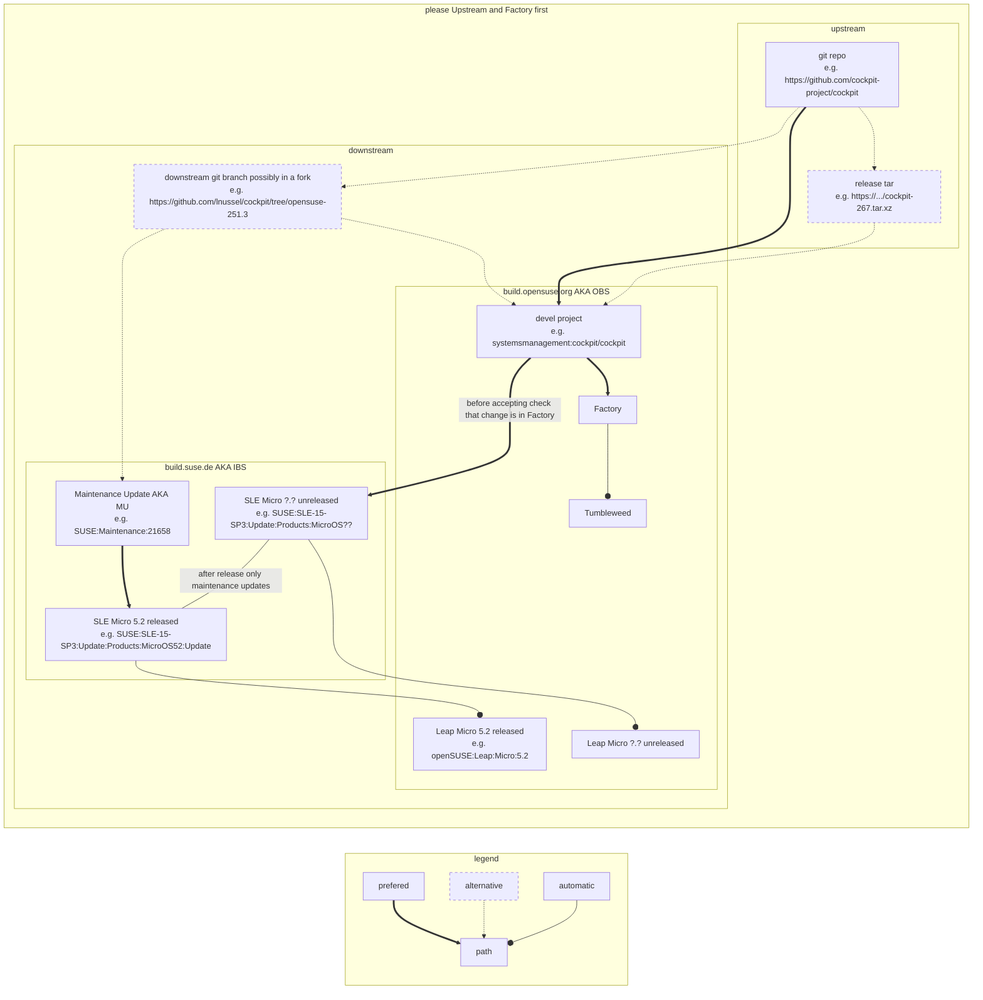

```mermaid
flowchart LR
  subgraph legend
      prefered ==> path
      alternative:::alt -.-> path
      automatic --o path
  end
  classDef alt stroke-dasharray: 5 5;
  subgraph please Upstream and Factory first
    subgraph upstream
      ug[git repo<br>e.g. https://github.com/cockpit-project/cockpit]
      ug -.-> ut
      ut[release tar<br>e.g. https://.../cockpit-267.tar.xz]:::alt
    end
    ug ==> op
    ug -.-> dg
    ut -.-> op
    subgraph downstream
      dg[downstream git branch possibly in a fork<br>e.g. https://github.com/lnussel/cockpit/tree/opensuse-251.3]:::alt
      subgraph build.opensuse.org AKA OBS
        op[devel project<br>e.g. systemsmanagement:cockpit/cockpit] ==> Factory
        Factory --o Tumbleweed
        Tumbleweed
        om[Leap Micro ?.? unreleased]
	omr[Leap Micro 5.2 released<br>e.g. openSUSE:Leap:Micro:5.2]
      end
      subgraph build.suse.de AKA IBS
        im[SLE Micro ?.? unreleased<br>e.g. SUSE:SLE-15-SP3:Update:Products:MicroOS??]
        imr[SLE Micro 5.2 released<br>e.g. SUSE:SLE-15-SP3:Update:Products:MicroOS52:Update]
	mu[Maintenance Update AKA MU<br>e.g. SUSE:Maintenance:21658]
      end
      dg -.-> op
      op =="before accepting check that change is in Factory"===> im
      im ---o om
      im --"after release only maintenance updates"--- imr
      dg -.-> mu ==> imr --o omr
    end
  end
```

